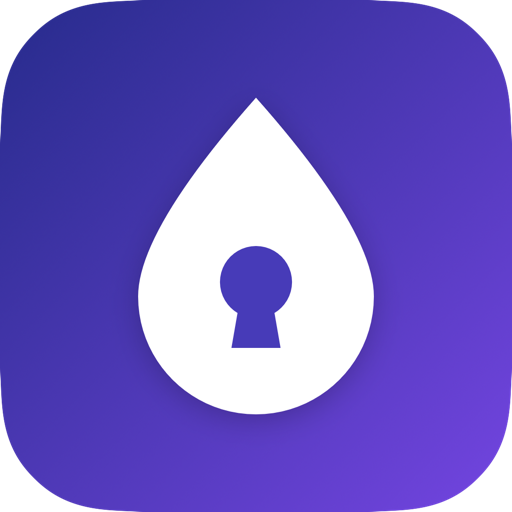

  

<h1 align="center">InkVault</h1>

  <b>Search your handwritten notes, PDFs, and recordings like they were typed.</b>

  A native macOS app that turns handwritten notes, scanned PDFs, lecture recordings,
  spreadsheets, and documents into one <b>private, AI-searchable</b> library —
  with exact <b>page and timestamp citations</b>. Everything is indexed on your Mac.

  

  
  
  

---

## ✨ Features
- 📄 **Handwriting, scans & printed docs** — OCR'd and searchable
- 🎙️ **Audio & lectures** — transcribed with click-to-seek timestamps
- 📊 **Spreadsheets** — rows indexed and answerable
- 🔎 **Hybrid local search** with ranked evidence cards
- 🧠 **Ask AI** — cited answers as a **concise answer**, **key points**, or **study notes**
- 🔒 **Local-first & private** — your files never leave your Mac
- ⌨️ **Global ⌃⌥Space command bar** — search from any app

## ⬇️ Download
Grab the latest `.dmg` from the **[Releases page](../../releases/latest)**.

> 🌐 **Website:** _coming soon_ — a one-click download page is on the way. <!-- TODO: replace with https://inkvault.app once live -->

**Requirements:** macOS 14 (Sonoma)+ · a free [Google Gemini API key](https://aistudio.google.com/apikey) for OCR, transcription, and Ask AI (search works locally).

## 🚀 Install
1. Open the `.dmg` and drag **InkVault** into **Applications**.
2. **First launch:** right-click InkVault → **Open** → **Open** (macOS asks once, since it's not from the App Store).
   - If it ever says *"damaged,"* run in Terminal: `xattr -dr com.apple.quarantine /Applications/InkVault.app`
3. Open **Settings (⌘,) → AI Model** and paste your Gemini key.

## 🎟️ Trial & licensing
Free for **14 days** — full features, no code needed. After that InkVault stays open in
**read-only** (you can still view and search your library) until you enter a license code.

## 🔐 Privacy
Your files, extracted text, search index, and API keys stay **on your Mac**. Only the
specific evidence for a question — never your whole library — is sent to Gemini (with
your key). No accounts, no tracking.

## 💬 Support
Questions or bugs: **abbas.j.mohamed@gmail.com**

---

© 2026 Abbas Mohamed. All rights reserved. InkVault is proprietary software — see <a href="LICENSE">LICENSE</a>.

